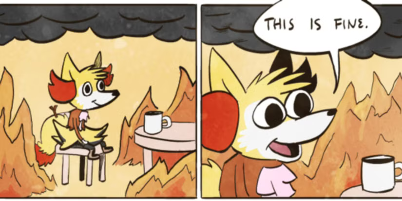
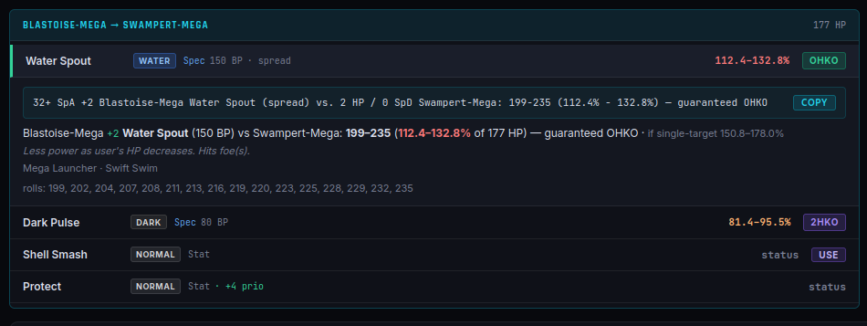
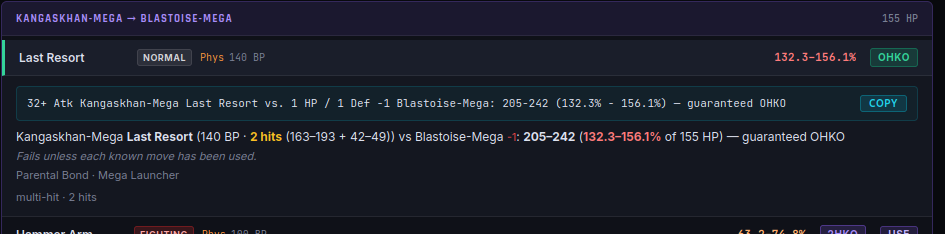
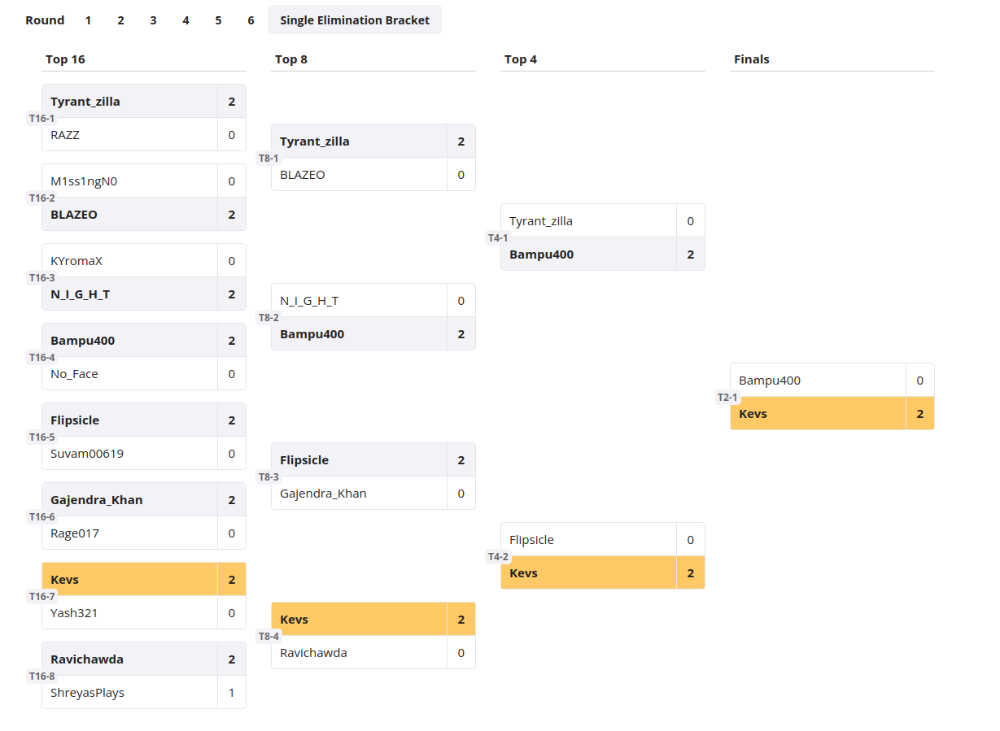
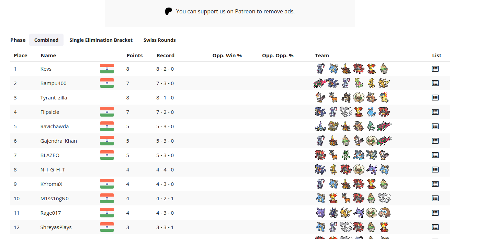
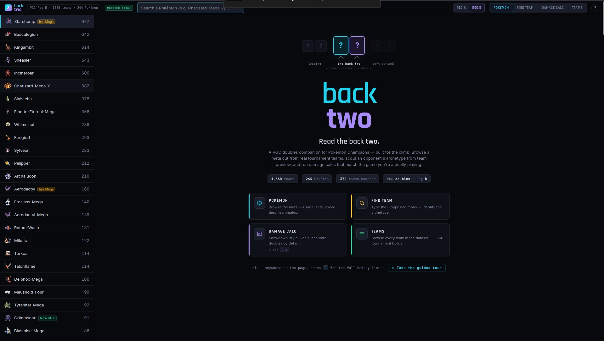

# I Entered My First Pokémon Champions Tournament—and Won the Whole Thing (VGC Breakdown)

*A first-timer's run through Rising Stars S1 — the losses, the 2am eureka that broke an undefeated Kangaskhan, and a grand final I never saw coming.*

---

There was one Kangaskhan in this tournament that had not lost a single game.

Metronome item, Last Resort, and a player behind it — tyrantzilla — who moved like they'd been doing this for years. It had run through the entire bracket. And sitting there on day one, staring down my first-ever tournament run, I was fairly sure that at some point I was going to have to find an answer to it.

Spoiler: the answer didn't come from out-damaging it. It came at about 2am, sick and half-asleep, staring at a Showdown replay.

But let me back up.

*My honest reaction to that undefeated Kangaskhan — and I hadn't even had to play it yet.*

## How I got here

I've been a Pokémon fan basically forever — Game Boy games as a kid, the whole thing. But competitive was a more recent rabbit hole. Last year I got deep into Scarlet & Violet VGC after falling down the WolfeyVGC YouTube hole (if you know, you know), mostly grinding Regulation I and F. I hit top 500 on the ladder, which was the first time I thought *okay, maybe I'm actually decent at this.*

Then Pokémon Champions dropped on mobile, and my friend Ishan — who I'd been playing VGC and Showdown with — added me to a WhatsApp group for the local scene. Someone posted a tournament. Rising Stars, Season 1. First one I'd ever entered.

It had a couple of special rules that I loved: **no weather, and no Floette.**

If you don't play Champions, here's why that matters. Floette-Eternal is, frankly, the pay-to-win Pokémon of the format — most people don't even have it, it's the strongest thing in the meta, and paired with Charizard-Y it is *everywhere.* Something like 60% of teams at the tournaments happening around the world were running Zard-Y + Floette. Some folks tried subbing Sylveon in for Floette, which kind of worked. Banning it (and weather) meant we all had to actually build something interesting.

*No Floette, no Zard-Y sun teams? A tournament I can actually team-build for.*

## The team

Mega Blastoise had already carried me to Master Ball tier on day one of both Season 3 and Season 4, so I knew and loved the big man. My own build back then was a Trick Room team — Torkoal, Oranguru, Sylveon, Ttar for the Zard-Y matchup.

*The love of my life, Mega Blastoise. 🐢*

But for this one, I found a Mega Blastoise team that Cybertron had posted on his channel — it paired Blastoise with Delphox and had a playstyle I really clicked with. I pulled it apart in [backtwo](https://kevv-j.github.io/backtwo/) — the Pokémon Champions companion I've been building — to see exactly what it ran, what the spreads were doing, and what it beat, and decided to run it for the tourney.

I went in with one goal: **have fun and learn.** And it was way more fun doing it alongside Ishan.

We spent the week going over teams and strats on Showdown. During practice, I realized I had a genuinely awful matchup into *Ishan's* team — specifically his Raichu-Y, which just outsped and threatened my whole squad. But hey. Surely it wouldn't come up in the actual tournament.

*(Remember this. It's going to matter.)*

*Me, deciding my worst matchup "won't come up." (Fennekin, naturally — I run Mega Delphox. 🔥)*

## Day 1 — Swiss

Tournament kicked off Saturday at 7pm.

**Round 1** I got drawn against Blazeo — a community mod from the WhatsApp group. First tournament match ever, against someone I looked up to in the group. I was *nervous.* But here's where the prep started paying off: on Limitless you get to see your opponent's team before the round, so I pasted it into backtwo and instantly had the speed tiers and the damage rolls — I knew which of my moves killed what, so a bunch of scary-looking leads turned into *known safe plays.* I played out of my mind and took it 2-0. Genuinely exhilarating.

*Seeing the OHKO before the game even starts — +2 Water Spout, 112–133% on Swampert-Mega, guaranteed. No more "does this kill?" anxiety.*

**Rounds 2 and 3** — back-to-back 2-0s, and Ishan was cruising too. I won't blow-by-blow these; a lot of the "clean" wins were clean *because* I'd already checked at team preview which moves killed and which didn't, so I could make the safe play every time instead of coinflipping leads.

**Round 4.** This was the one. tyrantzilla — probably the favorite to win the whole thing. Seasoned, patient, deadly. And *the* Kangaskhan: Metronome, Last Resort, and no lead I knew felt safe into it.

*Me, opening tyrantzilla's Kangaskhan set for the first time.*

Game 1 they got me on leads and I misplayed. Game 2 was razor-close and I edged it with a last-second Trick Room. Game 3, one mistake cost me my Shell-Smashed Blastoise, and from there the Kangaskhan's Last Resort just wiped my team — Kingambit went down to a Staraptor and that was that. **My first loss of the tournament.**

I was gutted for a minute. But mostly I realized: I *could* do better. I just wasn't used to fighting this kind of team and I hadn't adapted fast enough. Note that.

**Round 5** — clean win, back on track.

**Round 6** — a mirror match. (Did I mention there were *five* other teams on my exact core? There were.) This opponent had already played the mirror twice and clearly understood it — he'd basically said as much in the Limitless chat. Meanwhile I'd been going for three hours, the fatigue was real, and I was starting to feel genuinely sick.

Here's the thing I didn't figure out until it was too late: our Blastoises were on a **speed tie** — a straight coinflip — and I never realized it.

Game 1 I led poorly and got picked off on an overprediction. But twice during that set, *my* Blastoise moved before his. And his team sheet listed him as Modest — which tells you nothing about his actual speed investment, but it was just enough for me to talk myself into a story: *maybe he isn't running max speed. Maybe mine is genuinely faster.* So I played the rest of the match like I had the speed advantage locked in.

Game 2 I went for a Sinistcha Trick Room and got flinched by Dark Pulse turn one. Down to a Hail Mary, I made the play that only works if my Blastoise is faster — and his moved first, Dark Pulse into my Sinistcha before I could do a thing.

*That* was the moment the illusion shattered. It had been a coinflip the whole time. I'd won it twice, decided that made it a fact, and lost it the one time it actually decided the game — and my read and my run ended in the same instant. **Set gone, 2-0.**

And honestly? I wasn't mad. I'd made the best plays I could with the read I had. If I'd known from the start it was a 50/50, I'd have played around it and maybe stolen the set — but I didn't know, and I paid for the assumption. That's Pokémon.

*3 hours in, sick, and losing a speed tie I didn't even know I was flipping.*

**End of day 1:** I finished Swiss 4-2, seeded 3rd. Ishan was 5th. (Ishan had a rough back half — something came up in real life during rounds 5 and 6 and he couldn't give it his full focus, so his run took a hit.) The seeding meant we were on opposite ends of the bracket — which, in theory, meant we could both make the finals. Surely *that* wouldn't happen either.

And at the very top of the standings, seeded 1st: tyrantzilla. The *only* player in the entire tournament to run the whole of Swiss without dropping a single game. Still undefeated. That Kangaskhan still without an answer.

## The 2am eureka (a.k.a. how to hard-lock a Last Resort Kangaskhan)

After a bit of rest, I got to work on tomorrow's matchups. Most looked manageable. But I kept coming back to tyrantzilla, because if I made the finals I'd almost certainly see that Kangaskhan again.

First thing I did was run the raw numbers in backtwo. The verdict was brutal: once that Kangaskhan gets going, Last Resort damn near OHKOs my *entire* team. The only exception was Kingambit — being Dark/Steel, it eats the Normal-type Last Resort for half. Seeing on paper just how hopeless the straight damage race was is exactly what pushed me to stop thinking about damage and start thinking about the *mechanic.*

And then it hit me.

> **The Last Resort lock**
>
> Last Resort only works once you've used **every other move** on the set. So the standard line is: Fake Out turn 1, then Last Resort forever after.
>
> But — if you stop the Kangaskhan from moving on turn 1 with a **faster Fake Out**, then its own Fake Out never actually gets *used.*
>
> Turn 2, it can't Fake Out again (Fake Out only works on your first turn out), and it *still* can't Last Resort (because Fake Out is technically unused). It has one legal option left:
>
> **Struggle.**

I messaged Ishan and we jumped on Showdown to test it. **EUREKA.** We both happened to run Sneasler, which has a *faster* Fake Out than Kangaskhan — so if Sneasler Fake Outs the Kang before it can move, turn 2 it's forced to Struggle. We'd found a way to completely lock out the scariest Pokémon in the tournament.

The one catch: tyrantzilla also had Farigiraf, and its ability **Armor Tail** blocks priority moves like Fake Out for its entire side. So a clued-in player could switch Farigiraf in and our Fake Out simply wouldn't work — leaving the Kangaskhan free to do its thing. But that only saves them *if* they see the trap coming, and even accounting for it, we now had a real plan and a fighting chance. I went to sleep feeling like we'd cracked it.

*Guaranteed OHKO even on my Blastoise. But look at the fine print: "Fails unless each known move has been used." That one line is the entire exploit — deny the Fake Out, and Last Resort simply can't fire.*

## Day 2

I woke up *super* sick. Genuinely considered dropping. Felt a bit better by the afternoon and decided to play on.

- **Top 16:** opponent wasn't available, so I got a bye through.
- **Top 8:** a rematch against the player I'd beaten in Round 2. Another clean 2-0.
- **Top 4:** the 2nd seed — the one who'd knocked Ishan out in Round 6 — with a genuinely scary Azumarill team. Azumarill is terrifying because of one line: **Belly Drum** to max out its Attack (+6), then **Aqua Jet** — a priority move — to pick off my whole team before anyone can even move. Once it drums, you're basically dead to the jets. Except I had **Quick Guard** on Sneasler, which blocks priority moves for the whole turn. So I could shut the Aqua Jets down cold and set up Blastoise safely underneath it. **2-0, into the finals.**

Meanwhile, on the *other* side of the bracket…

*Opposite ends of the bracket (my run highlighted). Surely we wouldn't both make it. Right?*

## Ishan vs. the Kangaskhan

Ishan was on a rampage — clean 2-0s all the way to the semis, where he ran straight into the top seed. The final boss. **tyrantzilla — by now the last undefeated player in the entire tournament — and that Kangaskhan.** Everyone else had dropped a game to someone. Not them. Not once.

I grabbed the room ID from the group so I could spectate. This was the exact scenario we'd prepped for.

Game 1, tyrantzilla didn't lead the Kang (just like against me), but Ishan was ready and outplayed them for a clean win. Game 2, they switched to the Kangaskhan lead.

This was it. Ishan led Sneasler. Turn one, so much suspense — would tyrantzilla bring in Farigiraf, whose Armor Tail would shut the Fake Out off entirely? Would Ishan get metronome-Last-Resort'd into oblivion like everyone before him?

**No.** Sneasler moved first, Fake Out on the Kangaskhan. Turn two, they *didn't* switch — the Kang was locked into Struggle. That single opening was all Ishan needed; his Raichu-Y went absolutely supernova on their team. **Clean 2-0. Ishan was in the finals.**

*The prep WORKED. The undefeated Kangaskhan, forced to Struggle on the biggest stage.*

I was so, so happy for him. And then the realization landed like a truck.

All tournament, the bracket had been kind — we'd somehow gone the whole way without ever being drawn against each other, and part of me had quietly assumed it'd stay that way to the end. We'd both just get to win our own runs. But fate had other plans.

**We'd be facing each other in the finals.**

The two of us who'd prepped this team together, tested the Kangaskhan lock together, hyped each other up through every round — now pitted against each other in an all-out war for the whole thing. You couldn't script it better. (Or worse, depending on how you feel about having to end your best friend's run.)

*Wait. WAIT. Not like this.*

## The finals — best friend edition

We set a time and I got to prepping, same as I had for tyrantzilla — mapping leads and matchups against Ishan's team.

The scary part was, of course, Raichu-Y. Fastest thing in the matchup, capable of sweeping my entire team if it got going unchecked. My worst practice matchup, now in the grand final. Foreshadowing: paid.

While hunting for an answer, my brain went back to how I *lost* the Round 6 mirror. My opponent there had a clean technique — Follow Me / Rage Powder support (Maushold, Sinistcha, Clefairy) parked next to Blastoise, redirecting everything while Blastoise set up and swept.

That was the key. It would work *perfectly* into Raichu-Y: my Sinistcha could Rage Powder and redirect all of Raichu's attacks into itself while Blastoise set up and cleaned house.

**Game 1** went exactly to plan. I led Blastoise, supported by Fake Out from Sneasler and Incineroar and Rage Powder from Sinistcha, set up, and wiped his team.

**Game 2** was the mind game. If Ishan switched to Mega Meganium, it would hard-wall my Sinistcha *and* one-shot it —

> **Quick note on Mega Meganium:** its Mega ability, Mega Sol, makes all its moves behave as if the sun is up — *without* setting weather (so it doesn't break the tournament's no-weather rule). That means Weather Ball is Fire-type even in rain, Solar Beam fires in one turn, and so on. A Fire Weather Ball into my Grass/Ghost Sinistcha is a clean kill.

— so I planned for the switch. Game 2 I'd lead **Delphox** instead of Blastoise, predicting the Meganium swap. And even if Ishan *didn't* switch, Delphox could run the exact same setup line as Blastoise — only real downside being its spread Heat Wave has a chance to miss.

Game 2 starts and… he leads Raichu-Y again. Game 2 plays out almost identically to Game 1 — Delphox supported by Fake Out to set up, Rage Powder to protect it while it swept.

**And I won the tournament.**

*1st place, 8–2. My first tournament. Still doesn't feel real.*

## The payoff

I'd won. **4-2 in Swiss, then four straight wins through the bracket — 8–2, first place, first tournament ever.** All that prep — the 2am eureka, the calcs, the lead maps — paid off. And more than the trophy, it quietly silenced the doubt I'd been carrying about whether I was actually any good at this game.

First prize was an Eternal-Floette and a shiny. So the tournament that *banned* Floette for being pay-to-win handed me one as the reward for winning it — which means I finally have the P2W Pokémon for ranked. And a **shiny Incineroar.** THE GOAT. I could not have asked for a better prize.

*Shiny Incineroar AND the Floette I'm legally required to complain about. We won.*

## Shoutouts

Huge thank you to Sameer from BoTS for hosting so well, to our whole VGC community, and above all to Ishan — I genuinely could not have done this without you. Facing you in the finals was the perfect ending, and the fact that *our* prep is what finally broke that Kangaskhan is something I'll be smug about for a long time.

I learned a ton about how Limitless tournaments actually run, and I'm already looking forward to the next one.

---

*One last thing.* Every calc, every speed tier, every "does this kill?" I checked this weekend, I checked in a tool I've been building called **backtwo** — a free, open-source Pokémon Champions companion with a damage calculator, the full tournament team database, and a team finder that works backwards from the Pokémon you already run. I built it because I needed exactly this, and I figured other people in the climb might too. It's free, no ads — [give it a try](https://kevv-j.github.io/backtwo/) and go win your own.

*backtwo — the tool I used every round. Free and open source: kevv-j.github.io/backtwo*

---

## References & links

- **My winning team** — [view it on backtwo](https://kevv-j.github.io/backtwo/#/team/MB169) (full paste + spreads, right in the app)
- **The team I based mine on** — [Cybertron's Mega Blastoise / Delphox team](https://www.youtube.com/watch?v=fGGkAMnyZp4)
- **Tournament standings** — [Rising Stars S1 on Limitless](https://play.limitlesstcg.com/tournament/6a33cff8e334c3c9befd9250/standings)
- **Tournament usage & stats** — [Rising Stars S1 on Pikalytics](https://www.pikalytics.com/tournaments/limitless/rising-stars-s1-double-battle-fd9250)
- **The tool** — [backtwo](https://kevv-j.github.io/backtwo/) · [source on GitHub](https://github.com/Kevv-J/backtwo) (free, open source)
- **The channel that got me into VGC** — [WolfeyVGC](https://www.youtube.com/@WolfeyVGC)
